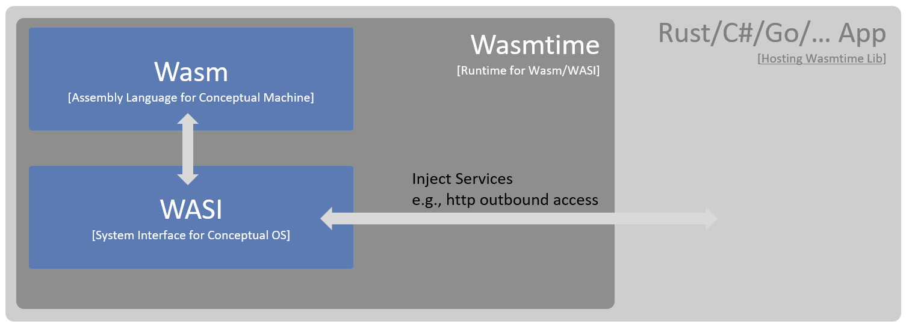
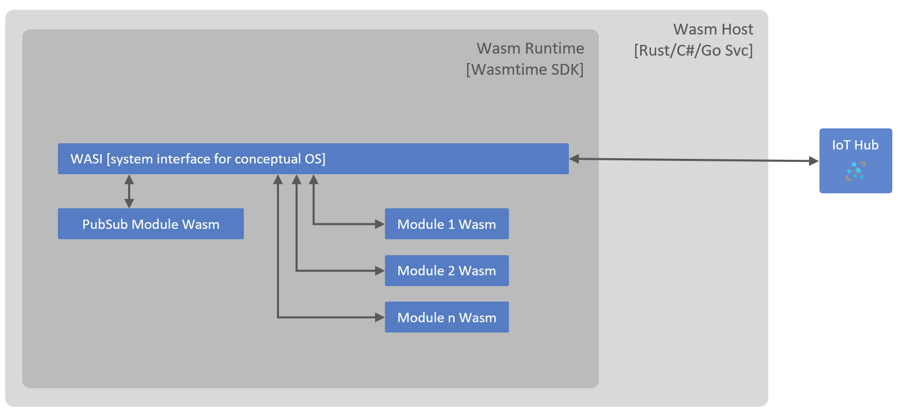
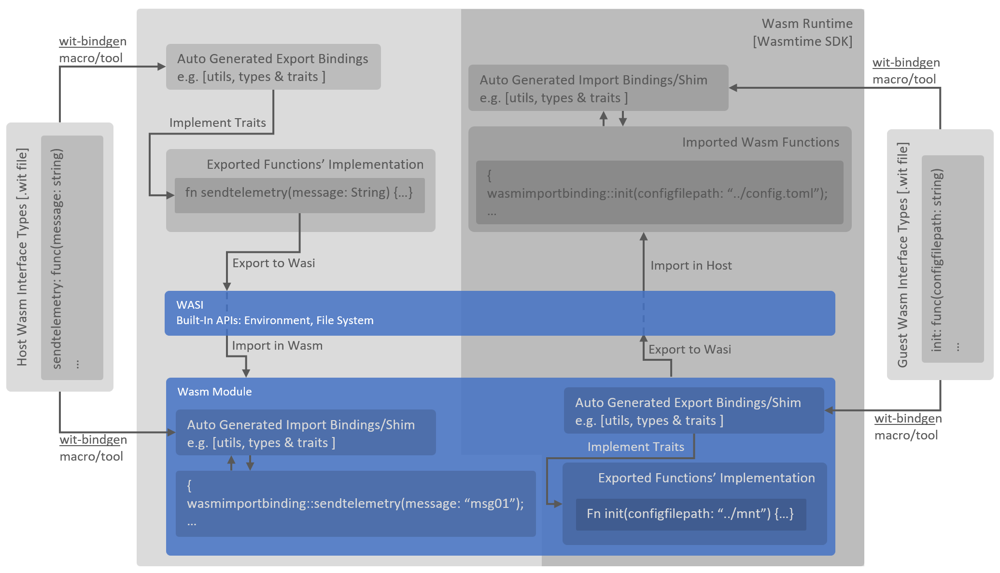
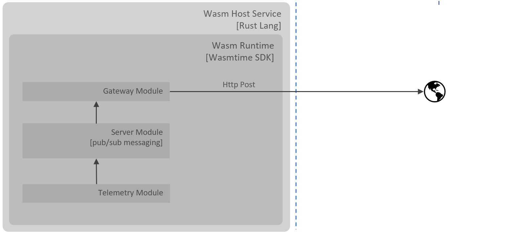

# Overview

This repo provides an accelerator to build and host Web Assemblies (Wasm) on server side. Intentionally, it does not make use of any of the [existing frameworks](#references), this allows us to explain the core concepts better.

WebAssembly (abbreviated as Wasm) is a binary instruction format for a [stack-based virtual machine](https://andreabergia.com/stack-based-virtual-machines/). It is designed as a standardised portable compilation target for programming languages, enabling deployment on the web for client and server applications, equally. Until recently, Wasm was used mostly in web browsers (client side), this is now changing as we see the benefits of Wasm being realised on server side or edge as well.

When Wasm is hosted outside of web browser, it needs an interface to interact with the outside world, this interface is provided [WASI (Web Assembly System Interface)](https://wasi.dev/) which is hosted by a standalone runtime called [Wasmtime](https://github.com/bytecodealliance/wasmtime). WASI interfaces makes Wasm portable to multiple operating systems' APIs (e.g. both POSIX and Windows) and [Wasmtime runtime SDKs](https://docs.wasmtime.dev/lang.html) allows us to host the runtime in other applications which may be written in any of the supported SDK languages, enabling the development of Wasm orchestrators.

## Why Wasm

This question has been answered already by many organisations and individuals alike, but here are some of the key tenets/promises of Wasm:

1. Portable (Hardware, Language and Platform)
2. Secure (sandboxed and secure by default)
3. Near native performance
4. Lightweight (when compared to containers)

## Common Challenges & Solutions

Wasm modules run in a sandbox provided by its runtime, this provides a default isolation boundary for the modules i.e. no access to the host resources. This is a great starting point, however most modules require some kind of interfacing with the host which is running these modules or access to the resources outside of their isolation boundary. Generally, interfacing with the outside world (from a Wasm module perspective) falls into the following:

1. Guest Wasm module needs to access host file system, this may be required to access a config file or persist data.
2. Guest Wasm module needs to make outbound http calls, this may be required to make a call to a RESTful web service.
3. Guest Wasm module needs to host a service on socket:port (endpoint), this may be required to host pub-sub messaging server.

This accelerator addresses these common challenges by making use of WASI, in three primary ways:

1. Using WASI's pre-built APIs e.g. file system APIs and socket APIs to access files and socket from the Wasm module.
2. [Importing host funtions](#wit-based-host-function-importexport-approach) to Wasm modules, and as these functions are defined in the host they have access to resources at the host level. Additionally, this mechanism provides a way to achieve [IoC](https://en.wikipedia.org/wiki/Inversion_of_control)/[DI](https://en.wikipedia.org/wiki/Dependency_injection) (Inversion of Control/Dependency Injection) pattern in Wasm modules.
3. [Exporting Wasm functions](#wit-based-host-function-importexport-approach) to host, these functions can be called by the host to bootstrap the Wasm module or interact with the module while its running.

The diagram below provides the conceptual view of the above points:

Modern applications consist of multiple services (often following microservices approach), these services interact with each other to achieve a business function. To enable this ecosystem of services to work together, we need to have a resilient messaging ecosystem, usually implemented by a [pub-sub](https://en.wikipedia.org/wiki/Publish%E2%80%93subscribe_pattern) component. In this solution, this pub-sub component is implemented as Wasm module hosting a pseudo pub-sub messaging server on an endpoint (a WASI pre-opened socket). This scenario is described in the diagram below:

### WIT Based Host Function Import/Export Approach

[WIT](https://github.com/bytecodealliance/wit-bindgen) (Web-Assembly Interface Types) host functions import approach allows the guest Wasm module to import functions from the host app. Consider WIT as a contract definition language between Wasm and host app via WASI, wit-bindgen tool takes this contract and generates bindings for different languages, very similar to how we create bindings for Open API Specs. These import functions are written in host app programming language e.g. Rust/C#/Go, allowing us to write functions to access resources on the host e.g. networking stack to connect to cloud. This is explained [“here (ignore some older termonologies)”](https://radu-matei.com/blog/wasm-components-host-implementations/). Same WIT based approach is used for exporting functions from Wasm module to Host, where they can be called.

## Solution Details

Solution implemented in the repo consist of the following components:

### Host Service

[Host service](host) encapsulates Wasm runtime, this runtime executes [guest Wasm modules](#guest-wasm-modules) which are pre-compiled into Wasm bytecode. The service makes use of Rust lang for development, but it could also be developed in any other language which is supported by [Wasmtime SDK](https://docs.wasmtime.dev/lang.html). Key responsiblities of this service are:

- Embeds Wasmtime runtime SDK
- Configures WASI to
  - Pre-open directory at host machine level to allow Wasm modules to access it.
  - Pre-open network socket and provide its handle to Wasm modules to listen traffic on. This is particularly useful if you want to host server in Wasm modules.
  - Export functions defined in the host service to Wasm modules.
  - Import functions from wasm modules, which can be called from host service to interact with the modules.

### Guest Wasm Modules

There are three Wasm modules in this solution:

1. Gateway

    Role of this Wasm module is to send http post to the external endpoint (create one at https://requestbin.com for testing) , it will subscribes to the events on Server/pub-sub module.

    `--gateway-allowed-host` parameter defines the permitted host which this wasm module can post messages to, specify your http post endpoint via this parameter for WASI to allow access and in Wasm module's config file `modules/gateway_module/src/config.rs` to post to this endpoint.

2. Server

    Role of this Wasm module is to run server which listens on a pre-opened socket, in this solution a psuedo pub/sub module. [Work in Progress]

    `--server-socket-address` parameter defines the endpoint on which server listens.

3. Telemetry

    Role of this module is to emit events which will be sent to Server/pub-sub module.

## Dev Setup

1. Open the solution in Codespaces
2. Compile modules to wasm32-wasi:
    1. `cd modules/telemetry_module`
    2. run `cargo build --target wasm32-wasi`
    3. `cd modules/gateway_module`
    4. run `cargo build --target wasm32-wasi`
    5. `cd modules/server_module`
    6. run `cargo build --target wasm32-wasi`
3. Compile and run app which hosts wasmtime and wasi with imported/exported functions to run above Wasm modules:
    1. `cd host`
    2. run `cargo run -- --gateway-allowed-host "<http post endpoint for gateway module, must match in modules/gateway_module/src/config.rs>" --server-socket-address "127.0.0.1:8080"`

## Refereces

1. [Fermyon's Spin](https://github.com/fermyon/spin)
2. [SpiderLightning (or, slight)](https://github.com/deislabs/spiderlightning)
3. [Containerd Wasm Shims](https://github.com/deislabs/containerd-wasm-shims)
4. [Docker + Wasm](https://www.docker.com/blog/docker-wasm-technical-preview/)
