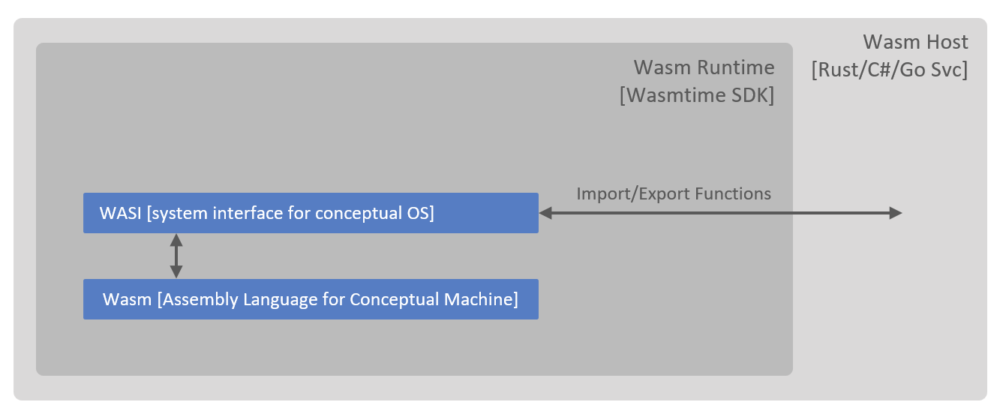

# Wasm-on-Edge

This repo provides an accelerator to deploy Web Assemblies for edge workloads.

WebAssembly (abbreviated Wasm) is a binary instruction format for a [stack-based virtual machine](https://andreabergia.com/stack-based-virtual-machines/). Wasm is designed as a portable compilation target for programming languages, enabling deployment on the web for client and server applications. Until recently, Wasm was used mostly in web browsers (client side), this is gradually changing as we are seeing benefits of Wasm being realised on server side as well.

The diagram below provides a conceptual view of how various components work together for hosting a Wasm outside of a web browser:

When Wasm is hosted outside of web browser, it needs an interface to interact with the outside world, this interface is provided [WASI (Web Assembly System Interface)](https://wasi.dev/) which is hosted by a standalone [Wasmtime](https://github.com/bytecodealliance/wasmtime) runtime. Further, to make Wasm portable to multiple operating systems' APIs (e.g. both POSIX and Windows), we leverage WASI interfaces. [Wasmtime runtime SDKs](https://docs.wasmtime.dev/lang.html) enable Wasmtime runtime to be hosted in other applications, enabling development of Wasm orchestrators.

In order to develop edge modules (Wasm binaries), we need to allow Wasm to make outbound Http calls to Azure IoT Hub via WASI. WASI is still in development and currently does not support many common interfaces. One such [interface is networking](https://github.com/WebAssembly/WASI/pull/312), which would have enabled making Http calls from Wasm to the outside world. To work around this limitation, Deis Labs (Microsoft) have developed an interim/stop-gap [solution](https://github.com/deislabs/wasi-experimental-http) which we make use of.

The solution makes use of [Azure IoT Hub](https://docs.microsoft.com/en-gb/azure/iot-hub/) for data, control and management plane purposes. In particular:

1. Edge modules send telemetry to IoT Hub for ingress and further routing
2. Device Twins are used to configure signal configuration Wasm based modules on the edge, from IoT Hub
